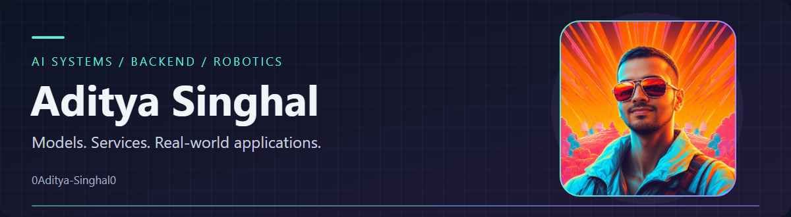
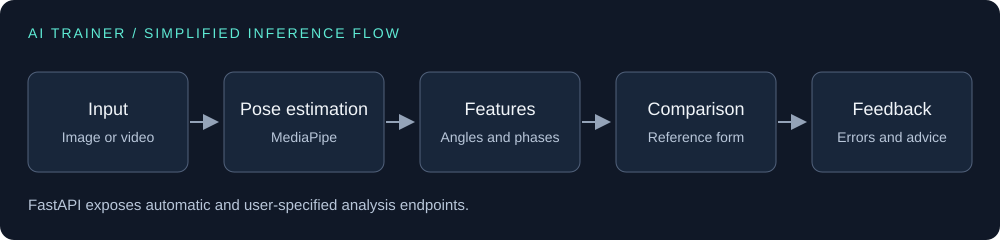

  

<h1 align="center">Aditya Singhal</h1>

  
  
  

  <a href="#selected-projects">Selected work</a> &nbsp;·&nbsp;
  <a href="#architecture-and-system-design">System design</a> &nbsp;·&nbsp;
  <a href="#technical-capabilities">Tools</a> &nbsp;·&nbsp;
  <a href="#research-and-publications">Research</a>

AI systems engineer working across applied machine learning, backend systems, deployment infrastructure, computer vision, and autonomous systems.

I build software that connects models to APIs, services, data, users, and hardware. My work covers inference pipelines, multimodal applications, AI infrastructure, and research in robotics and control.

## Current work and interests

My current interests are agentic systems, multimodal applications, AI deployment infrastructure, and robotics. I care about how a model connects to its API, data flow, background jobs, and deployment.

I'm exploring personal AI infrastructure through [Jarvis](https://github.com/0Aditya-Singhal0/jarvis) and mobile assistant workflows through [assistant-calendar](https://github.com/0Aditya-Singhal0/assistant-calendar). Both are developing projects.

## Selected projects

<table>
<tr>
<td width="50%" valign="top">
<h3><a href="https://github.com/0Aditya-Singhal0/AI_trainer">AI fitness trainer</a></h3>

Exercise recognition, repetition counting, and comparison against reference movement. Extends Riccardo Riccio's fitness trainer with form analysis and API integration.

<code>Computer vision</code> <code>TensorFlow</code> <code>FastAPI</code>

<a href="https://github.com/0Aditya-Singhal0/AI_trainer#architecture">Read the architecture</a>

</td>
<td width="50%" valign="top">
<h3><a href="https://github.com/0Aditya-Singhal0/comfy_runner">Comfy Runner</a></h3>

Tooling for running ComfyUI workflows as an application backend, with model downloads, custom node installation, and output handling.

<code>Generative AI</code> <code>Python</code> <code>Workflow execution</code>

<a href="https://github.com/0Aditya-Singhal0/comfy_runner">Explore the repository</a>

</td>
</tr>
<tr>
<td width="50%" valign="top">
<h3><a href="https://github.com/0Aditya-Singhal0/TD3PG_Obstacle_Avoidance_Sim">Obstacle avoidance simulator</a></h3>

TD3PG implementation and a custom Matplotlib environment for reinforcement learning experiments. The robot feedback integration is incomplete.

<code>Reinforcement learning</code> <code>Python</code> <code>Simulation</code>

<a href="https://github.com/0Aditya-Singhal0/TD3PG_Obstacle_Avoidance_Sim">Explore the simulation</a>

</td>
<td width="50%" valign="top">
<h3><a href="https://github.com/0Aditya-Singhal0/moveit_with_GPD">MoveIt with grasp detection</a></h3>

Integration work connecting MoveIt with grasp pose detection in a ROS workflow.

<code>ROS</code> <code>MoveIt</code> <code>Grasp planning</code>

<a href="https://github.com/0Aditya-Singhal0/moveit_with_GPD">Explore the integration</a>

</td>
</tr>
</table>

<!-- Confirm the specific Comfy Runner contribution before adding an authorship claim. -->

## Architecture and system design

The [AI trainer](https://github.com/0Aditya-Singhal0/AI_trainer#architecture) connects pose estimation and movement analysis to a FastAPI service. This is a simplified view of its documented inference flow.

My broader system design interests include service boundaries, model loading, queues and workers, caching, storage, containerized deployment, and observability.

## Technical capabilities

### AI and vision

Applied machine learning, pose estimation, sequence models, generative AI, and multimodal pipelines.

### Backend and data

APIs, inference services, data processing, background jobs, and application integration.

### Infrastructure

Containers, cloud infrastructure, deployment automation, and reproducible environments.

### Applications and robotics

Web and mobile interfaces, simulation, trajectory planning, and control.

## Impact and results

The AI trainer documents recognition for four main exercise types, automatic and user-specified analysis endpoints, and feedback with detected deviations and recommendations. These are documented capabilities, not performance benchmarks.

My public robotics work includes a custom simulation environment and grasp planning integration. The repositories show implementation details and current limitations.

## Research and publications

- [Quiz in PG Teaching: Are we Adapted to New Methods in Learning?](https://doi.org/10.4103/jmms.jmms_8_23), Journal of Marine Medical Society, 2023
- [Knowledge, Attitude, and Practice of Rabies Postexposure Prophylaxis among Young Doctors](https://doi.org/10.4103/jmms.jmms_9_23), Journal of Marine Medical Society, 2023
- [A Study on Autonomic Dysfunction in Type 2 Diabetes Mellitus with Peripheral Neuropathy](https://doi.org/10.4103/jmms.jmms_6_24)

See my [ORCID record](https://orcid.org/0000-0003-0623-7140).

## Experience snapshot

My experience includes applied AI systems, backend and infrastructure work, computer vision, generative-media workflows, robotics research, autonomous transport, and client-facing technical delivery. Some of this work lives in private repositories, so the public projects above show only part of it.

## Current status

Open to conversations about AI systems engineering, backend and infrastructure roles, applied machine learning, computer vision, generative AI, and robotics software.

## Links

- [GitHub](https://github.com/0Aditya-Singhal0)
- [LinkedIn](https://www.linkedin.com/in/aditya-x-singhal)
- [ORCID](https://orcid.org/0000-0003-0623-7140)

<!-- Add confirmed portfolio and public resume URLs to the hero links when available. -->
<!-- LOWLIGHTER:START -->
<!-- Reserved for selected lowlighter metrics after plugin choices are confirmed. -->
<!-- LOWLIGHTER:END -->
